# معمارية الإعدادات ونظام الهوية — Settings Architecture & IA

وثيقة المعمارية الرسمية لنظام الإعدادات الموحد وإدارة الهوية والعلامة التجارية في **Boutq OS**.

---

## 1. المبادئ المعمارية وسجل الإعدادات الموحد (Single Source of Truth)

تعتمد صفحة الإعدادات (`/admin/b/$slug/settings`) في Boutq OS على مبدأ **المصدر الوحيد للحقيقة** لمنع أي تضارب بين الحقول أو تكرار كتابة البيانات في جداول متعددة:

1. **سجل موحد وشامل (`SETTINGS_REGISTRY`)**:
   - المعرّف في `src/features/settings/registry.ts`.
   - يضم تعريفا دقيقا لكل عمود في جدول `business_settings` وكل عمود قابل للإعداد في جدول `brands`.
   - يحدد لكل إعداد:
     - `key`: اسم العمود في قاعدة البيانات.
     - `table`: الجدول التابع له (`business_settings` أو `brands`).
     - `owner`: المسؤول الحصري عن تعديله (`settings` أو `route:pages` أو `route:integrations` أو `route:team` أو `route:expenses` أو `system`).
     - `tab`: التبويب الأساسي (`identity` | `storefront` | `orders` | `notifications` | `account`) أو `null` إذا لم يكن ملك الإعدادات.
     - `group`: معرّف المجموعة داخل التبويب للربط العميق (Deep Linking).
     - `level`: مستوى الإفصاح (`basic` أو `advanced`).
     - `type`: نوع الحقل (`text`, `textarea`, `number`, `boolean`, `color`, `select`, `image`, `font`, `json`).
     - `label`: التسمية الثنائية (عربي وإنجليزي).
     - `keywords`: الكلمات المفتاحية للبحث الشامل.
2. **عزل الملكية وتفادي الكتابة المتوازية**:
   - لا يمكن لحقل أن يمتلك كاتبين في النظام (No Dual-Writer).
   - الحقول المدارة في شاشات مستقلة (مثل `pages` في شاشة الصفحات والسياسات، `whatsapp_marketing_*` في التواصل) تسجل بـ `owner: "route:*"` وتكون للقراءة فقط أو ترشد المستخدم لشاشتها الأصلية.
3. **حراسة التكافؤ الآلية (Parity Guard Test)**:
   - الاختبار `tests/settings-registry-parity.test.ts` يفحص `src/integrations/supabase/types.ts` عند كل تشغيل، ويرفض أي عمود مضاف لجدول `business_settings` دون توثيقه في السجل، كما يضمن عدم وجود حقول يتيمة أو تكرارات.

---

## 2. هيكلة التبويبات والمجموعات الخمس (5 Tabs IA)

تنقسم الإعدادات وفق **قرار المالك رقم 5** إلى 5 تبويبات أساسية مرتبة منطقياً حسب رحلة التاجر:

```mermaid
graph TD
    Settings[صفحة إعدادات المتجر]
    Settings --> T1[1. identity - الهوية والعلامة]
    Settings --> T2[2. storefront - المتجر والرئيسية]
    Settings --> T3[3. orders - الطلبات والمدفوعات]
    Settings --> T4[4. notifications - الإشعارات]
    Settings --> T5[5. account - الحساب والأمان]

    T1 --> G1[basics: الاسم والشعار والرمز]
    T1 --> G2[vertical: نوع النشاط والوحدات]
    T1 --> G3[palette: لوحة الألوان]
    T1 --> G4[typography: الخطوط]
    T1 --> G5[contact: التواصل والعنوان]

    T2 --> G6[mode: وضع البيع]
    T2 --> G7[home_hero: واجهة الهيرو]
    T2 --> G8[home_sections: أقسام الرئيسية]
    T2 --> G9[header_footer: الترويسة والتذييل]
    T2 --> G10[announcement: شريط الإعلانات]
    T2 --> G11[loader: شاشة التحميل]
    T2 --> G12[seo: محركات البحث]

    T3 --> G13[payments: طرق الدفع]
    T3 --> G14[pricing: العملة والضريبة]
    T3 --> G15[fulfillment: التوصيل والاستلام]
    T3 --> G16[invoice: الفاتورة والشروط]

    T4 --> G17[templates: قوالب الرسائل]
    T4 --> G18[recipients: مستلمو الإشعارات]

    T5 --> G19[security: وضع الصيانة ووصول الدعم]
```



---

### مجموعة واحدة في الشاشة (`GroupNavigator`)

داخل كل تبويب لا تُكدَّس المجموعات فوق بعضها؛ يعرض `src/features/settings/GroupNavigator.tsx`
متصفّح مجموعات (رقائق تلتف على الجوال، قائمة جانبية لاصقة على سطح المكتب) ويُصيّر **المجموعة
النشطة فقط**. هذا يقلّص التمرير إلى شاشة واحدة تقريباً لكل مجموعة ويُلغي تصيير الحقول غير
المرئية. القواعد:

- المجموعة النشطة تأتي من `?group=` في الرابط، ثم من آخر اختيار محفوظ لكل تبويب
  (`localStorage: boutq_settings_active_group`)، ثم أول مجموعة.
- البحث وقائمة الجاهزية وبانر "ابدأ من هنا" **تختار** المجموعة عبر `SettingsNavContext`
  بدل التمرير إلى مرساة.
- الحفظ على مستوى النموذج كله (diff)، لذا تبديل المجموعة مع تغييرات غير محفوظة آمن.
- كل مجموعة تعرّف في ملف التبويب كـ `GroupDef { id, icon, render }`؛ التسمية تأتي من
  `SETTINGS_GROUPS` تلقائياً (أو `label` لأقسام خارج السجل مثل "ترقية المظهر").

### شريط الحفظ والـ dock على الجوال

`SettingsStickySaveBar` يطالب بالمكان السفلي عبر `src/lib/bottom-bar-store.ts` ما دام
ظاهراً (تغييرات غير محفوظة أو حفظ جارٍ)، و`OsIslandDock` يختفي تلقائياً أثناء ذلك ويعود بعده.
لا يتراكب عنصران في أسفل الشاشة أبداً.

## 3. الإفصاح التدريجي (Basic vs. Advanced Levels)

لتحقيق تجربة مستخدم عالمية (Shopify/Linear level) دون إرباك التاجر المبتدئ:

1. **الوضع الافتراضي (Basic Mode)**:
   - يعرض فقط الإعدادات الجوهرية لبدء البيع (ميزانية صارمة: $\le 45$ حقلاً أساسياً على مستوى النظام بالكامل، محققة حالياً بـ 41 حقلاً).
   - يخفي التفاصيل الدقيقة (أبعاد الهوامش، نصوص القوالب البديلة، خيارات الهيرو المتقدمة، شاشات التحميل).
2. **الوضع المتقدم (Advanced Mode)**:
   - يُفعل بتبديل مفتاح واحد في رأس الصفحة (`SettingsHeader`) عبر `useSettingsLevel()`.
   - الحقول المتقدمة تُغلف بمكوّن `<AdvancedOnly>` داخل المجموعات.
3. **البحث الذكي الموحد (Universal Search & Cmd+K)**:
   - اختصار لوحة المفاتيح `Cmd+K` أو `/` يفتح شريط البحث الفوري.
   - يبحث في الأسماء والكلمات المفتاحية بالعربية والإنجليزية والمفاتيح التقنية.
   - عند اختيار نتيجة متقدمة أثناء وجود المستخدم في الوضع الأساسي، يقوم النظام **تلقائياً** بتفعيل الوضع المتقدم والانتقال للتبويب والمجموعة المعنية دون أن يضيع المستخدم.

---

## 4. نموذج الحفظ الذري الموحد (Unified Atomic Save Model)

تم استبدال نماذج الحفظ المتفرقة والمجزأة بنموذج سياق موحد:

1. **`useBrandSettingsFormContext`**:
   - يدير الحالة المؤقتة (Draft State) لجميع حقول `business_settings` وبيانات `brands` المسموحة.
   - يحسب الفروقات الدقيقة (`computeDraftDiff`) مقارنة بالحالة الأصلية في الخادم (Server Baseline).
2. **شريط الحفظ العائم (`SettingsStickySaveBar`)**:
   - يظهر فقط عند وجود تعديلات غير محفوظة (`isDirty`).
   - يعرض عدّاد التغييرات الدقيق (مثال: `3 تغييرات غير محفوظة`).
   - ينفذ حفظاً ذرياً متزامناً لجدولي `brands` و `business_settings` دفعة واحدة عبر `updateBrand` و `updateSettings`.
3. **حماية التغييرات من الضياع (Navigation Guards)**:
   - منع الخروج الداخلي عبر `useBlocker` من `@tanstack/react-router`.
   - منع إغلاق أو تحديث التبويب عبر `window.beforeunload`.
4. **المعاينة الحية الفورية (`LivePreviewPane`)**:
   - لوحة جانبية اختيارية في الشاشات الواسعة ($\ge$ `xl`).
   - تسمح للتاجر بمعاينة متجره الفعلي في إطار محمول (360px) أو شاشة مكتبية.
   - تقوم بتحديث الـ iframe تلقائياً بمجرد إتمام الحفظ.

---

## 5. جاهزية المتجر وتوجيه الزيارة الأولى (Store Readiness & Guidance)

1. **قائمة جاهزية المتجر (`StoreReadinessChecklist`)**:
   - تحسب نسبة اكتمال المتجر من البيانات الفعلية:
     - رفع الشعار والاسم.
     - استخراج لوحة الألوان الذكية من الشعار (`brand_palette.meta.source === 'logo'`).
     - تحديد نوع النشاط التجاري المتخصص (`store_vertical`).
     - إضافة منتجات في الكتالوج.
     - تفعيل وسيلة دفع واحدة على الأقل.
   - الضغط على أي عنصر يوجه المستخدم فوراً للتبويب ومجموعة الإعداد المطلوبة.
2. **شريط توجيه الزيارة الأولى (`FirstVisitIntroBanner`)**:
   - يظهر للتاجر الجديد في تبويب الهوية لمساعدته في الخطوات المتسلسلة (الشعار $\leftarrow$ الألوان $\leftarrow$ الخطوط $\leftarrow$ نوع النشاط).
   - يحفظ حالة الإغلاق محلياً.

---

## 6. دليل مطوّر: "كيف تضيف إعداداً جديداً في 4 خطوات"

إذا أردت إضافة خيار إعداد جديد لأي براند:

### الخطوة 1: تحديث قاعدة البيانات (Migration)

إذا كان الحقل عموداً جديداً، أضفه في migration بجدول `business_settings` ثم شغّل توليد الأنواع:

```sql
ALTER TABLE business_settings ADD COLUMN my_new_setting BOOLEAN DEFAULT false;
```

```bash
npm run types:supabase
```

### الخطوة 2: التسجيل في `SETTINGS_REGISTRY`

في الملف `src/features/settings/registry.ts`، أضف تعريف الحقل:

```typescript
{
  key: "my_new_setting",
  table: "business_settings",
  tab: "storefront",
  group: "home_sections",
  level: "advanced", // أو "basic" إذا كان جوهرياً (مع مراعاة سقف الـ 45 حقل)
  owner: "settings",
  type: "boolean",
  label: { ar: "تفعيل ميزتي الجديدة", en: "Enable My New Feature" },
  keywords: { ar: ["ميزة جديدة", "خاصية"], en: ["new feature", "toggle"] },
},
```

### الخطوة 3: عرض الحقل في مكوّن المجموعة المناسب

في المجلد `src/features/settings/tabs/<tab>/<GroupComponent>.tsx`:

```tsx
import { useBrandSettingsFormContext } from "@/features/settings/use-brand-settings-form";
import { AdvancedOnly } from "@/features/settings/FieldVisibility";

export function MyGroup() {
  const { values, setValue } = useBrandSettingsFormContext();

  return (
    <AdvancedOnly>
      <div className="flex items-center justify-between">
        <Label htmlFor="my_new_setting">تفعيل ميزتي الجديدة</Label>
        <Switch
          id="my_new_setting"
          checked={Boolean(values.my_new_setting)}
          onCheckedChange={(checked) => setValue("my_new_setting", checked)}
        />
      </div>
    </AdvancedOnly>
  );
}
```

### الخطوة 4: التحقق وتشغيل اختبارات الحراسة

تحقق من سلامة الأنواع وعدم وجود كسر في سجل الإعدادات:

```bash
npx vitest run tests/settings-registry-parity.test.ts tests/settings-tabs.test.ts
npx tsc --noEmit
```

سيرفض الاختبار الآلي أي حقل ينقصه التوثيق أو يتجاوز سقف الحقول الأساسية أو غير مربوط بالتبويبات!

> **كيف يعرّف الحارس "الربط الحقيقي"؟** يفحص ملفات `src/features/settings/tabs/**/*.tsx` فقط، ويعتبر
> الحقل مربوطاً عندما يُقرأ من حالة النموذج (`bs.<key>` / `brand.<key>`) أو يُكتب عبر
> `setBs("<key>", …)` / `setBs({ <key>: … })` أو يُمرَّر كمفتاح مكتوب في مصفوفة إعدادات (`key: "<key>"`)
> أو عبر `fieldKey="<key>"`. ذكر الاسم في تسمية أو تعليق أو ملف بيانات **لا يُحتسب** — لذلك لا يوجد
> ملف "قائمة أعمدة" داخل المجلد يمكن أن يُرضي الحارس زوراً. الاستثناءان الوحيدان: الحقول ذاتية الحفظ
> (`store_vertical`, `store_modules`, `fit_profiles` عبر `StoreProfileCard`) و`support_access_enabled`
> (يُمرَّر البراند كاملاً إلى `SupportAccessCard`).

### مجموعة "خيارات المظهر الجديد" (`storefront.design_v2`)

كل عمود أضافته ترقية Storefront 2.0 (شريط الثقة، بطاقة المنتج، التذييل والنشرة، قصتنا، الفلاتر،
صفحة المنتج، الدليل الاجتماعي، الحركة، نبّهني عند التوفر…) يُعدَّل من مجموعة واحدة
`tabs/storefront/DesignV2Group.tsx`. النصوص التي تخص مكاناً آخر منطقياً تبقى في مكانها:
`business_hours_*` في **الهوية ← التواصل**، `shipping_returns_*` في **الطلبات ← التوصيل**،
`bundle_discount_percent` في **الطلبات ← العملة والضريبة**.
